# MultiHazard 

The `MultiHazard` package provides tools for stationary multivariate statistical modeling, for example, to estimate joint occurrence probabilities of MULTIple co-occurring HAZARDs. The package contains functions for pre-processing data including imputing missing values, detrending and declustering time series as well as analyzing pairwise correlations over a range of lags. Functionality is built in to implement the conditional sampling - copula theory approach in [Jane et al. (2020)](https://doi.org/10.5194/nhess-20-2681-2020) including the automated threshold selection method in [Solari et al. (2017)](https://doi.org/10.1002/2016WR019426). There is a function that calculates joint probability contours using the method of overlaying (conditional) contours given in [Bender et al. (2016)](https://doi.org/10.1080/02626667.2015.1052816), and extracts design events such as the "most likely" event or an ensemble of possible design events. Three higher dimensional approaches - standard (elliptic/Archimedean) copulas, Pair Copula Constructions (PCCs) and the conditional threshold exceedance approach of [Heffernan and Tawn (2004)](https://doi.org/10.1111/j.1467-9868.2004.02050.x) are coded. Finally, the package can be implemented to derive temporally coherent extreme events comprising a hyetograph and water level curve for a simulated peak rainfall and peak sea level as outlined in (Report).  

### Citation: 
>Jane, R., Cadavid, L., Obeysekera, J., and Wahl, T. (2020). Multivariate statistical modelling of the drivers of compound flood events in South Florida, Nat. Hazards Earth Syst. Sci., 20, 2681–2699, https://doi.org/10.5194/nhess-20-2681-2020.

<br>

### Applications of package: 
>Maduwantha, P., Wahl, T., Santamaria-Aguilar, S., Jane, R., Booth, J. F., Kim, H., and Villarini, G., (2024). A multivariate statistical framework for mixed populations in compound flood analysis, EGUsphere, https://doi.org/10.5194/egusphere-2024-1122.

>Nasr, A. A., Wahl, T., Rashid, M. M., JAne, R., Camus, P. and Haigh, I. D., (2023)  Temporal changes in dependence between compound coastal and inland flooding drivers around the contiguous United States coastline, Weather and Climate Extremes, 41, 100594, https://doi.org/10.1016/j.wace.2023.100594

>Kim, H., Villarini, G., Jane, R., Wahl, T., Misra, S., and Michalek, A. (2023). On the generation of high‐resolution probabilistic design events capturing the joint occurrence of rainfall and storm surge in coastal basins, Int. J. Climatol, 43(2), 761-771, https://doi.org/10.1002/joc.7825.

>Kim, T., Villarini, G., Kim, H., Jane, R., and Wahl, T. (2023). On the compounding of nitrate loads and discharge, J. Environ. Qual., 52, 706–717. https://doi.org/10.1002/jeq2.20458.

>Peña, F., Obeysekera, J., Jane R., Nardi, F., Maran, C., Cadogan, A., de Groen, F., and Melesse, A. (2023) Investigating compound flooding in a low elevation coastal karst environment using multivariate statistical and 2D hydrodynamic modeling, Weather Clim. Extrem., 39, 100534. https://doi.org/10.1016/j.wace.2022.100534.

<br>

## Installation
Install the latest version of this package by entering the following in R:
```r
install.packages("remotes")
remotes::install_github("rjaneUCF/MultiHazard")
```

## 1. Introduction

The `MultiHazard` package provides tools for stationary multivariate statistical modeling, for example, to estimate the joint distribution of MULTIple co-occurring HAZARDs. This document is designed to explain and demonstrate the functions contained within the package. Section 1 looks at the functions concerned with pre-processing the data including imputing missing values. Section 2 illustrates the functions for detrending and declustering time series while Section 3 introduces a function that analyzes pairwise correlations over a range of lags. Section 4 shows how the conditional sampling - copula theory approach in Jane et al. (2020) can be implemented including the automated threshold selection method in Solari et al. (2017). Functions for selecting the best fitting amongst an array of (non-extreme, truncated and non-truncated) parametric marginal distributions, and copulas to model the dependence structure are demonstrated in this section. Section 4 also contains an explanation of the function that derives the joint probability contours according to the method of overlaying (conditional) contours given in Bender et al. (2016), and extracts design events such as the "most likely" event or an ensemble of possible design events. Section 5 introduces the functions for fitting and simulating synthetic events from three higher dimensional approaches - standard (elliptic/Archimedean) copulas, Pair Copula Constructions (PCCs) and the conditional threshold exceedance approach of Heffernan and Tawn (2004). Section 6 describes a function that calculates the time for a user-specified height of sea level rise to occur under various scenarios. Lastly, Section 7 shows the simulation of temporally coherent extreme rainfall and ocean water level events.

## 2. Pre-processing

### Imputation

Well G\_3356 represents the groundwater level at Site S20, however, it contains missing values. Lets impute missing values in the record at Well G\_3356 using recordings at nearby Well G\_3355. Firstly, reading in the two time series.

``` r
#Viewing first few rows of in the groundwater level records
head(G_3356)
```

    ##         Date Value
    ## 1 1985-10-23  2.46
    ## 2 1985-10-24  2.47
    ## 3 1985-10-25  2.41
    ## 4 1985-10-26  2.37
    ## 5 1985-10-27  2.63
    ## 6 1985-10-28  2.54

``` r
head(G_3355)
```

    ##         Date Value
    ## 1 1985-08-20  2.53
    ## 2 1985-08-21  2.50
    ## 3 1985-08-22  2.46
    ## 4 1985-08-23  2.43
    ## 5 1985-08-24  2.40
    ## 6 1985-08-25  2.37

``` r
#Converting Date column to "Date"" object
G_3356$Date<-seq(as.Date("1985-10-23"), as.Date("2019-05-29"), by="day")
G_3355$Date<-seq(as.Date("1985-08-20"), as.Date("2019-06-02"), by="day")
#Converting column containing the readings to a "numeric"" object
G_3356$Value<-as.numeric(as.character(G_3356$Value))
G_3355$Value<-as.numeric(as.character(G_3355$Value))
```

Warning message confirms there are NAs in the record at Well G\_3356. Before carrying out the imputation the two data frames need to be merged.

``` r
#Merge the two dataframes by date
GW_S20<-left_join(G_3356,G_3355,by="Date")
colnames(GW_S20)<-c("Date","G3356","G3355")
#Carrying out imputation
Imp<-Imputation(Data=GW_S20,Variable="G3356",
                x_lab="G-3355 (ft NGVD 29)", y_lab="G-3356 (ft NGVD 29)")
```


The completed record is given in the `ValuesFilled` column of the data frame outputted as the `Data` object while the linear regression model including its coefficient of determinant are given by the `model` output argument.

``` r
head(Imp$Data)
```

    ##         Date G3356 G3355 ValuesFilled
    ## 1 1985-10-23  2.46  2.87         2.46
    ## 2 1985-10-24  2.47  2.85         2.47
    ## 3 1985-10-25  2.41  2.82         2.41
    ## 4 1985-10-26  2.37  2.79         2.37
    ## 5 1985-10-27  2.63  2.96         2.63
    ## 6 1985-10-28  2.54  2.96         2.54

``` r
Imp$Model
```

    ## 
    ## Call:
    ## lm(formula = data[, variable] ~ data[, Other.variable])
    ## 
    ## Residuals:
    ##      Min       1Q   Median       3Q      Max 
    ## -1.60190 -0.16654  0.00525  0.16858  1.73824 
    ## 
    ## Coefficients:
    ##                        Estimate Std. Error t value Pr(>|t|)    
    ## (Intercept)            0.275858   0.012366   22.31   <2e-16 ***
    ## data[, Other.variable] 0.700724   0.004459  157.15   <2e-16 ***
    ## ---
    ## Signif. codes:  0 '***' 0.001 '**' 0.01 '*' 0.05 '.' 0.1 ' ' 1
    ## 
    ## Residual standard error: 0.2995 on 11825 degrees of freedom
    ##   (445 observations deleted due to missingness)
    ## Multiple R-squared:  0.6762, Adjusted R-squared:  0.6762 
    ## F-statistic: 2.47e+04 on 1 and 11825 DF,  p-value: < 2.2e-16

Are any values still NA?

``` r
G_3356_ValueFilled_NA<-which(is.na(Imp$Data$ValuesFilled)==TRUE)
length(G_3356_ValueFilled_NA) 
```

    ## [1] 3

Linear interpolating the three remaining NAs.

``` r
G3356_approx<-approx(seq(1,length(Imp$Data$ValuesFilled),1),Imp$Data$ValuesFilled,
                     xout=seq(1,length(Imp$Data$ValuesFilled),1))
Imp$Data$ValuesFilled[which(is.na(Imp$Data$ValuesFilled)==TRUE)]<-
  G3356_approx$y[which(is.na(Imp$Data$ValuesFilled)==TRUE)]
```

### Detrending

In the analysis completed O-sWL (Ocean-side Water Level) and groundwater level series are subsequently detrended. The Detrend() function uses either a linear fit covering the entire data (Method=`linear`) or moving averge window (Method=`window`) of a specified length (`Window_Width`) to remove trends from a time series. The residuals are added to the final `End_Length` observations. The default Detrend() parameters specify a moving average (Method=`window`) three month window (Window\_Width=`89`), to remove any seasonality from the time series. The deafult is then to add the residuals to the average of the final five years of observations (End\_Length=`1826`) to bring the record to the present day level, accounting for the Perigian tide in the case of O-sWL. The mean of the observations over the first three months were subtracted from the values during this period before the present day (5 year) average was added. The following R code detrends the record at Well G\_3356. Note the function requires a Date object and the completed series.

``` r
#Cresaring a data from with the imputed series alongside the corresponding dates 
G_3356_Imp<-data.frame(Imp$Data$Date,Imp$Data$ValuesFilled)
colnames(G_3356_Imp)<-c("Date","ValuesFilled")
#Detrending
G_3356_Detrend<-Detrend(Data=G_3356_Imp,PLOT=TRUE,x_lab="Date",
                        y_lab="Groundwater level (ft NGVD 29)")
```


Output of the Detrend\_3Month() function is simply the detrended time series.

``` r
head(G_3356_Detrend)
```

    ## [1] 2.394700 2.411588 2.360033 2.327588 2.595588 2.520255

Creating a data frame containing the detrended groundwater series at site S\_20 i.e. G\_3356\_Detrend and their corresponding dates

``` r
S20.Groundwater.Detrend.df<-data.frame(as.Date(GW_S20$Date),G_3356_Detrend)
colnames(S20.Groundwater.Detrend.df)<-c("Date","Groundwater")
```

### Declustering

The Decluster() function declusters a time series using a threshold u specified as a quantile of the completed series and separation criterion SepCrit to ensure independent events. If mu=365.25 then SepCrit denotes the minimum number of days readings must remain below the threshold before a new event is defined.

``` r
G_3356.Declustered<-Decluster(Data=G_3356_Detrend,u=0.95,SepCrit=3,mu=365.25)
```

    ## Warning in x.exceed.max.position[i] <- (x.exceed.lower.bound) +
    ## which(Data[(x.exceed.lower.bound + : number of items to replace is not a
    ## multiple of replacement length

Plot showing the completed, detrended record at Well G-3356 (grey circles) along with cluster maxima (red circles) identified using a 95% threshold (green line) and three day separation criterion.

``` r
G_3356_Imp$Detrend<-G_3356_Detrend
plot(as.Date(G_3356_Imp$Date),G_3356_Imp$Detrend,col="Grey",pch=16,
     cex=0.25,xlab="Date",ylab="Groundwater level (ft NGVD 29)")
abline(h=G_3356.Declustered$Threshold,col="Dark Green")
points(as.Date(G_3356_Imp$Date[G_3356.Declustered$EventsMax]),
       G_3356.Declustered$Declustered[G_3356.Declustered$EventsMax],
       col="Red",pch=16,cex=0.5)
```

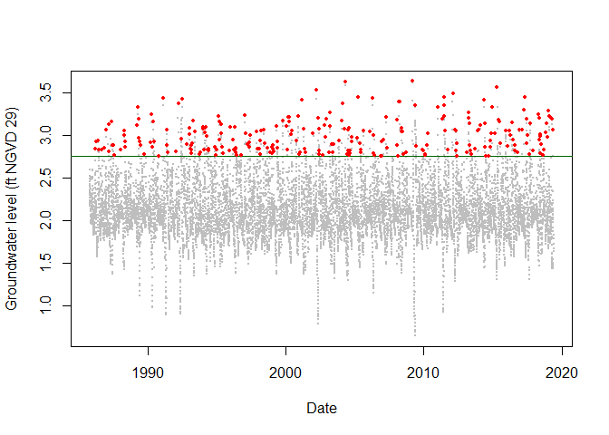

Other outputs from the Decluster() function include the threshold on the original scale

``` r
G_3356.Declustered$Threshold
```

    ## [1] 2.751744

and the number of events per year

``` r
G_3356.Declustered$Rate
```

    ## [1] 7.857399

In preparation for later work, lets assign the detrended and declustered groundwater series at site S20 a name.

``` r
S20.Groundwater.Detrend.Declustered<-G_3356.Declustered$Declustered
```

Reading in the other rainfall and O-sWL series at Site S20

``` r
#Changing names of the data frames
S20.Rainfall.df<-Perrine_df
S20.OsWL.df<-S20_T_MAX_Daily_Completed_Detrend_Declustered[,c(2,4)]
#Converting Date column to "Date"" object
S20.Rainfall.df$Date<-as.Date(S20.Rainfall.df$Date)
S20.OsWL.df$Date<-as.Date(S20.OsWL.df$Date)
```

Detrending and declustering the rainfall and O-sWL series at Site S20

``` r
S20.OsWL.Detrend<-Detrend(Data=S20.OsWL.df,Method = "window",PLOT=FALSE,
                          x_lab="Date",y_lab="O-sWL (ft NGVD 29)")
```

Creating a dataframe with the date alongside the detrended OsWL series

``` r
S20.OsWL.Detrend.df<-data.frame(as.Date(S20.OsWL.df$Date),S20.OsWL.Detrend)
colnames(S20.OsWL.Detrend.df)<-c("Date","OsWL")
```

Declustering rainfall and O-sWL series at site S20,

``` r
#Setting missing values to zero 
S20.Rainfall.Declustered<-Decluster(Data=S20.Rainfall.df$Value,u=0.95,SepCrit=3)$Declustered
S20.OsWL.Detrend.Declustered<-Decluster(Data=S20.OsWL.Detrend,u=0.95,SepCrit=3,mu=365.25)$Declustered
```

Creating data frames with the date alongside declustered series

``` r
S20.OsWL.Detrend.Declustered.df<-data.frame(S20.OsWL.df$Date,S20.OsWL.Detrend.Declustered)
colnames(S20.OsWL.Detrend.Declustered.df)<-c("Date","OsWL")
S20.Rainfall.Declustered.df<-data.frame(S20.Rainfall.df$Date,S20.Rainfall.Declustered)
colnames(S20.Rainfall.Declustered.df)<-c("Date","Rainfall")
S20.Groundwater.Detrend.Declustered.df<-data.frame(G_3356$Date,S20.Groundwater.Detrend.Declustered)
colnames(S20.Groundwater.Detrend.Declustered.df)<-c("Date","OsWL")
```

Use the Dataframe\_Combine function to create data frames containing all observations of the original, detrended if necessary, and declustered time series. On dates where not all variables are observed, missing values are assigned NA.

``` r
S20.Detrend.df<-Dataframe_Combine(data.1<-S20.Rainfall.df,
                                  data.2<-S20.OsWL.Detrend.df,
                                  data.3<-S20.Groundwater.Detrend.df,
                                  names=c("Rainfall","OsWL","Groundwater"))
S20.Detrend.Declustered.df<-Dataframe_Combine(data.1<-S20.Rainfall.Declustered.df,
                                              data.2<-S20.OsWL.Detrend.Declustered.df,
                                              data.3<-S20.Groundwater.Detrend.Declustered.df,
                                              names=c("Rainfall","OsWL","Groundwater"))
```

The package contains two other declustering functions. The Decluster\_SW() function declusters a time series via a storm window approach. A moving window of length (Window\_Width) is moved over the time series, if the maximum value is located at the center of the window then the value is considered a peak and retained, otherwise it is set equal to NA. For a seven day window at S20:

``` r
S20.Rainfall.Declustered.SW<-Decluster_SW(Data=S20.Rainfall.df,Window_Width=7)
```

Plotting the original and detrended series:

``` r
plot(S20.Rainfall.df$Date,S20.Rainfall.df$Value,pch=16,cex=0.5,
     xlab="Date",ylab="Total daily rainfall (Inches)")
points(S20.Rainfall.df$Date,S20.Rainfall.Declustered.SW$Declustered,pch=16,col=2,cex=0.5)
```


Repeating the analysis for the O-sWL with a 3-day window.

``` r
S20.OsWL.Declustered.SW<-Decluster_SW(Data=S20.OsWL.df,Window_Width=3)
```

The Decluster\_S\_SW() function declusters a summed time series via a storm window approach. First a moving window of width (Window\_Width\_Sum) travels across the data and each time the values are summed. As with the Decluster\_SW function a moving window of length (Window\_Width) is then moved over the time series, if the maximum value in a window is located at its center then the value considered a peak and retained, otherwise it is set equal to NA. To decluster weekly precipitation totals using a seven day storm window at S20:

``` r
#Declustering
S20.Rainfall.Declustered.S.SW<-Decluster_S_SW(Data=S20.Rainfall.df, 
                                              Window_Width_Sum=7, Window_Width=7)
#First ten values of the weekly totals
S20.Rainfall.Declustered.S.SW$Totals[1:20]
```

    ##  [1]   NA   NA   NA 0.23 0.19 0.10 1.56 1.94 2.04 2.04 2.04 2.91 3.02 2.75 3.15
    ## [16] 3.05 3.05 3.05 2.18 2.03

``` r
#First ten values of the declustered weekly totals
S20.Rainfall.Declustered.S.SW$Declustered[1:20]
```

    ##  [1]   NA   NA   NA   NA   NA   NA   NA   NA   NA   NA   NA   NA   NA   NA 3.15
    ## [16]   NA   NA   NA   NA   NA

Plotting the original and detrended series:

``` r
plot(S20.Rainfall.df$Date,S20.Rainfall.Declustered.S.SW$Totals,pch=16,cex=0.5,
     xlab="Date",ylab="Total weekly rainfall (Inches)")
points(S20.Rainfall.df$Date,S20.Rainfall.Declustered.S.SW$Declustered,pch=16,col=2,cex=0.5)
```

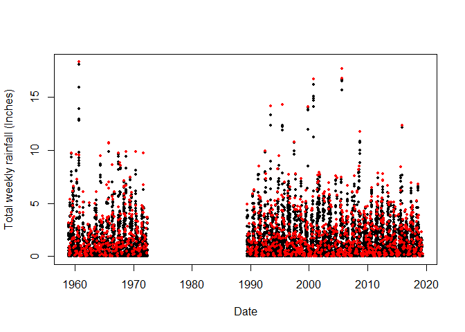

#### Fit GPD

The GPD\_Fit() function fits a generalized Pareto distribution (GPD) to observations above a threshold u, specified as a quantile of the completed time series. To fit the distribution the GPD\_Fit() function requires the declustered series as its Data argument and the entire completed series, detrended if necessary, as its Data.Full argument. The completed series is required to calcuate the value on the original scale corresponding to u. If PLOT=="TRUE" then diagnostic plots are produced to allow an assessment of the fit.

``` r
GPD_Fit(Data=S20.Detrend.Declustered.df$Rainfall,Data_Full=na.omit(S20.Detrend.df$Rainfall),
        u=0.997,PLOT="TRUE",xlab_hist="O-sWL (ft NGVD 29)",y_lab="O-sWL (ft NGVD 29)")
```

    ## Call: evm(y = Data, th = Thres, penalty = "gaussian", priorParameters = list(c(0, 
    ##     0), matrix(c(100^2, 0, 0, 0.25), nrow = 2)))
    ## Family:       GPD 
    ## 
    ## Model fit by penalized maximum likelihood.
    ## 
    ## Convergence:     TRUE
    ## Threshold:       3.547
    ## Rate of excess:      0.002798
    ## 
    ##   Log lik.   Penalized log lik.  AIC      
    ##   -67.20101  -67.31616           138.40203
    ## 
    ## 
    ## Coefficients:
    ##        Value   SE    
    ## phi:   0.3514  0.2366
    ## xi:    0.1697  0.1781

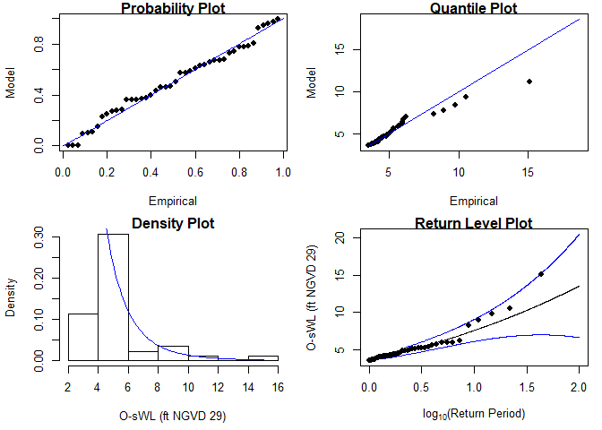

    ## $Threshold
    ## [1] 3.5465
    ## 
    ## $Rate
    ## [1] 0.002797914
    ## 
    ## $sigma
    ## [1] 1.421037
    ## 
    ## $xi
    ## [1] 0.1696554
    ## 
    ## $sigma.SE
    ## [1] 0.2365755
    ## 
    ## $xi.SE
    ## [1] 0.1781031

#### Solari (2017) automated threshold selection

Solari et al. (2017) proposes a methodology for automatic threshold estimation, based on an EDF-statistic and a goodness of fit test to test the null hypothesis that exceedances of a high threshold come from a GPD distribution.

EDF-statistics measure the distance between the empirical distribution *F*<sub>*n*</sub> obtained from the sample and the parametric distribution *F*(*x*). The Anderson Darling *A*<sup>2</sup> statistic is an EDF-statistic, which assigns more weight to the tails of the data than similar measures. Sinclair et al. (1990) proposed the right-tail weighted Anderson Darling statistic *A*<sub>*R*</sub><sup>2</sup> which allocates more weight to the upper tail and less to the lower tail of the distribution than *A*<sup>2</sup> and is given by:
$${A}\_{R}^{2}= -\\frac{n}{2} -  \\sum\_{i=1}^{n} \\left\[\\left(2-\\frac{(2i-1)}{n}\\right)log(1-z\_{i})+2z\_{i}\\right\] $$
 where *z* = *F*(*x*) and *n* is the sample size. The approach in Solari et al. (2017) is implemented as follows:

1.  A time series is declustered using the storm window approach to identify independent peaks.
2.  Candidate thresholds are defined by ordering the peaks and removing any repeated values. A GPD is fit to all the peaks above each candidate threshold. The right-tail weighted Anderson-Darling statistic *A*<sub>*R*</sub><sup>2</sup> and its corresponding p-value are calculated for each threshold.
3.  The threshold that minimizes one minus the p-value is then selected.

The GPD\_Threshold\_Solari() function carries out these steps.

``` r
S20.Rainfall.Solari<-GPD_Threshold_Solari(Event=S20.Rainfall.Declustered.SW$Declustered,
                                          Data=S20.Detrend.df$Rainfall)
```

    ## Fitted values of xi < -0.5

    ## Error in solve.default(family$info(o)) : 
    ##   Lapack routine dgesv: system is exactly singular: U[2,2] = 0
    ## Error in diag(o$cov) : invalid 'nrow' value (too large or NA)

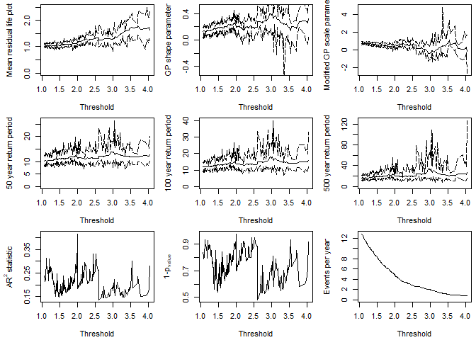

The optimum threshold according to the Solari appraoch is

``` r
S20.Rainfall.Solari$Candidate_Thres
```

    ## [1] 2.6

``` r
Rainfall.Thres.Quantile<-ecdf(S20.Detrend.df$Rainfall)(S20.Rainfall.Solari$Candidate_Thres)
```

The GPD\_Threshold\_Solari\_Sel() allows the goodness-of-fit at a particular threshold (`Thres`) to be investigated in more detail. Lets study the fit of the threshold selectd by the Solari et al. (2017) method.

``` r
Solari.Sel<-GPD_Threshold_Solari_Sel(Event=S20.Rainfall.Declustered.SW$Declustered,
                                    Data=S20.Detrend.df$Rainfall,
                                    Solari_Output=S20.Rainfall.Solari,
                                    Thres=S20.Rainfall.Solari$Candidate_Thres,
                                    RP_Max=100)
```

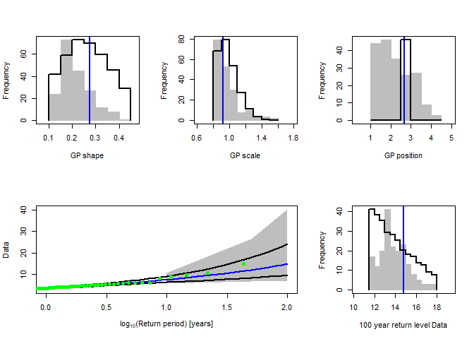

Repeating the automated threshold selection procedure for O-sWL.

``` r
S20.OsWL.Solari<-GPD_Threshold_Solari(Event=S20.OsWL.Declustered.SW$Declustered,
                                      Data=S20.Detrend.df$OsWL)
```

    ## Fitted values of xi < -0.5
    ## Fitted values of xi < -0.5
    ## Fitted values of xi < -0.5

    ## Error in solve.default(family$info(o)) : 
    ##   system is computationally singular: reciprocal condition number = 3.51497e-17
    ## Error in diag(o$cov) : invalid 'nrow' value (too large or NA)

    ## Fitted values of xi < -0.5
    ## Fitted values of xi < -0.5

    ## Error in solve.default(family$info(o)) : 
    ##   system is computationally singular: reciprocal condition number = 8.58552e-17
    ## Error in diag(o$cov) : invalid 'nrow' value (too large or NA)

    ## Fitted values of xi < -0.5
    ## Fitted values of xi < -0.5
    ## Fitted values of xi < -0.5
    ## Fitted values of xi < -0.5
    ## Fitted values of xi < -0.5
    ## Fitted values of xi < -0.5

    ## Error in solve.default(family$info(o)) : 
    ##   system is computationally singular: reciprocal condition number = 4.6787e-17
    ## Error in diag(o$cov) : invalid 'nrow' value (too large or NA)

    ## Fitted values of xi < -0.5

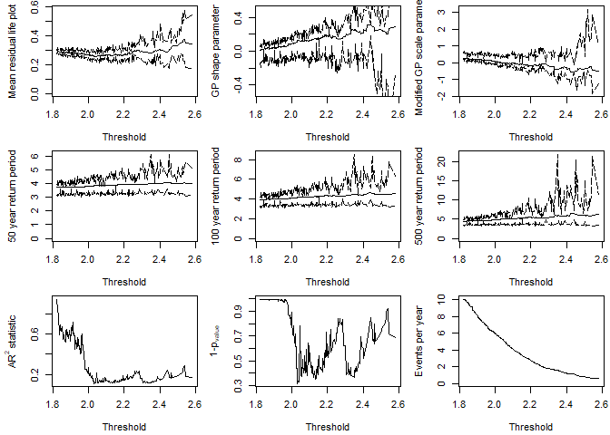

``` r
S20.OsWL.Solari$Candidate_Thres
```

    ## [1] 2.032

``` r
OsWL.Thres.Quantile<-ecdf(S20.Detrend.df$OsWL)(S20.OsWL.Solari$Candidate_Thres)
```

and checking the fit of the GPD at the selected threshold.

``` r
Solari.Sel<-GPD_Threshold_Solari_Sel(Event=S20.OsWL.Declustered.SW$Declustered,
                                     Data=S20.Detrend.df$OsWL,
                                     Solari_Output=S20.OsWL.Solari,
                                     Thres=S20.OsWL.Solari$Candidate_Thres,
                                     RP_Max=100)
```


## 3. Correlation analysis

We can use the `Kendall_Lag` function to view the Kendall's rank correlations coefficient *τ* between the time seres over a range of lags

``` r
S20.Kendall.Results<-Kendall_Lag(Data=S20.Detrend.df,GAP=0.2)
```

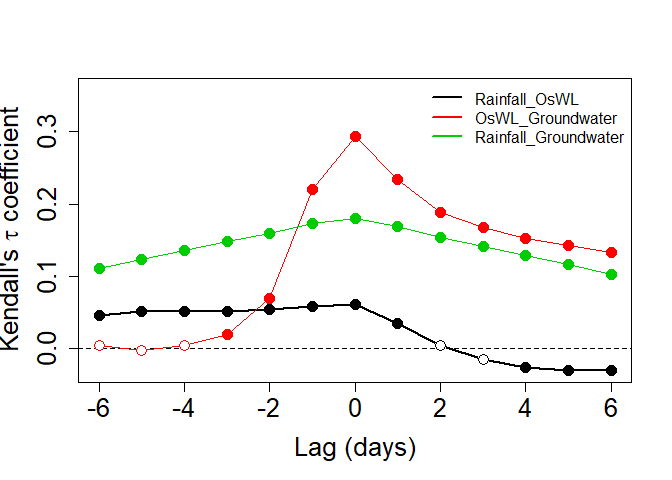

Lets pull out the Kendall correlation coefficient values between rainfall and O-sWL for lags of −5, ..., 0, ..,5 applied to the latter quantity

``` r
S20.Kendall.Results$Value$Rainfall_OsWL
```

    ##  [1]  0.046483308  0.051860955  0.051392298  0.051311970  0.054097316
    ##  [6]  0.058316831  0.061388245  0.035305812  0.004206059 -0.014356749
    ## [11] -0.025993095 -0.030431776 -0.029481162

and the corresponding p-values testing the null hypothesis *τ* = 0

``` r
S20.Kendall.Results$Test$Rainfall_OsWL_Test
```

    ##  [1] 5.819748e-13 1.014698e-15 8.196547e-16 1.030482e-15 5.160274e-17
    ##  [6] 1.887733e-19 1.987221e-20 2.232548e-07 4.033739e-01 7.669577e-02
    ## [11] 1.186248e-03 6.352872e-05 3.864403e-05

## 4. Bivariate Analysis

In the report the 2D analysis considers the two forcings currently accounted for in structural design assessments undertaken by SFWMD: rainfall and O-sWL. The 2D analysis commences with the well-established two-sided conditional sampling approach, where excesses of a conditioning variable are paired with co-occurring values of another variable to create two samples. For each sample the marginals (one extreme, one non-extreme) and joint distribution are then modeled.

The two (conditional) joint distributions are modeled independently of the marginals by using a copula. The Copula\_Threshold\_2D() function explores the sensitivity of the best fitting copula, in terms of Akaike Information Criterion (AIC), to allow the practitioner to make an informed choice with regards to threshold selection. It undertakes the conditional sampling described above and reports the best fitting bivariate copula. The procedure is carried out for a single or range of thresholds specified by the `u` argument and the procedure is automatically repeated with the variables switched.

``` r
Copula_Threshold_2D(Data_Detrend=S20.Detrend.df[,-c(1,4)],
Data_Declust=S20.Detrend.Declustered.df[,-c(1,4)],
y_lim_min=-0.075, y_lim_max =0.25,
Upper=c(2,9), Lower=c(2,10),GAP=0.15)
```

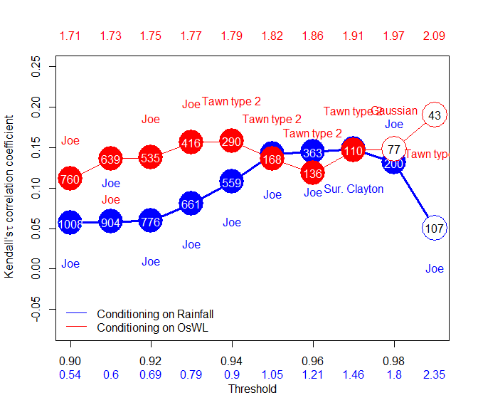

    ## $Kendalls_Tau1
    ##  [1] 0.05627631 0.05803451 0.05900376 0.08072261 0.10731477 0.14151449
    ##  [7] 0.14427232 0.14762199 0.13101587 0.05056147
    ## 
    ## $p_value_Var1
    ##  [1] 7.753313e-03 9.308844e-03 1.409365e-02 2.031126e-03 1.800556e-04
    ##  [6] 1.268207e-05 4.555495e-05 2.309717e-04 7.367252e-03 5.236705e-01
    ## 
    ## $N_Var1
    ##  [1] 1008  904  776  661  559  432  363  286  200  107
    ## 
    ## $Copula_Family_Var1
    ##  [1]  6  6  6  6  6  6  6 13  6  6
    ## 
    ## $Kendalls_Tau2
    ##  [1] 0.1113049 0.1359921 0.1377104 0.1561184 0.1579352 0.1359861 0.1183870
    ##  [8] 0.1463056 0.1482198 0.1904729
    ## 
    ## $p_value_Var2
    ##  [1] 3.111295e-05 3.130393e-06 1.201990e-05 1.226532e-05 2.030287e-04
    ##  [6] 1.218006e-02 4.758068e-02 3.021842e-02 6.691436e-02 7.073874e-02
    ## 
    ## $N_Var2
    ##  [1] 760 639 535 416 290 168 136 110  77  43
    ## 
    ## $Copula_Family_Var2
    ##  [1]   6   6   6   6 204 204 204 204   1 204

The Diag\_Non\_Con() function is designed to aid in the selection of the appropriate (non-extreme) unbounded marginal distribution for the non-conditioned variable.

``` r
S20.Rainfall<-Con_Sampling_2D(Data_Detrend=S20.Detrend.df[,-c(1,4)],
Data_Declust=S20.Detrend.Declustered.df[,-c(1,4)],
Con_Variable="Rainfall",u = Rainfall.Thres.Quantile)
Diag_Non_Con(Data=S20.Rainfall$Data$OsWL,x_lab="O-sWL (ft NGVD)",y_lim_min=0,y_lim_max=1.5)
```

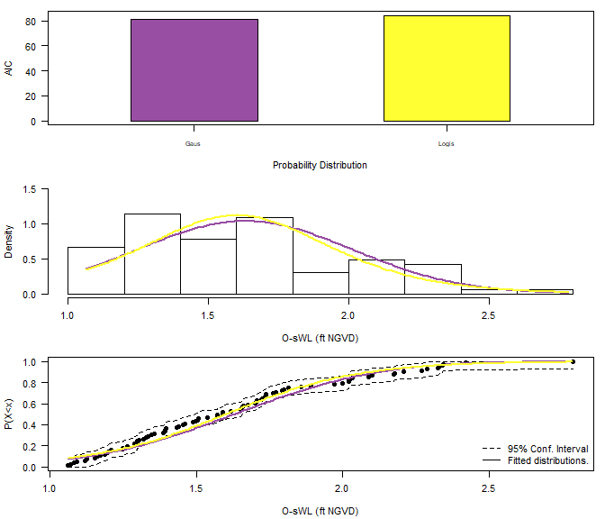

    ## $AIC
    ##   Distribution      AIC
    ## 1       Normal 81.27871
    ## 2     Logistic 84.19031
    ## 
    ## $Best_fit
    ## [1] Normal
    ## Levels: Logistic Normal

The Diag\_Non\_Con\_Sel() function, is similar to the Diag\_Non\_Con() command, but only plots the probability density function and cumulative distribution function of a (single) selected univariate distribution in order to more clearly demonstrate the goodness of fit of a particular distribution. The options are the Gaussian (`Gaus`) and logistic (`Logis`) distributions.

``` r
Diag_Non_Con_Sel(Data=S20.Rainfall$Data$OsWL,x_lab="O-sWL (ft NGVD)",
y_lim_min=0,y_lim_max=1.5,Selected="Logis")
```

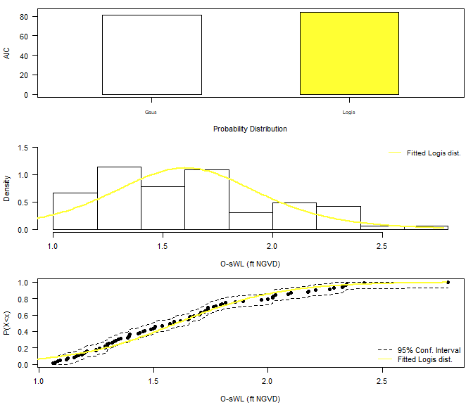

A generalized Pareto distribution is fitted to the marginal distribution of the conditioning variable i.e. the declustered excesses identified using Con\_Sampling\_2D().

The process of selecting a conditional sample and fitting marginal distributions is repeated but instead conditioning on O-sWL. The non-conditional variable in this case is (total daily) rainfall, which has a lower bound at zero, and thus requires a suitably truncated distribution. The `Diag_Non_Con_Trunc` fits a selection of truncated distributions to a vector of data. The `Diag_Non_Con_Sel_Trunc` function is analogous to the 'Diag\_Non\_Con\_Sel' function, avalibale distributions are the Birnbaum-Saunders (`BS`), exponential (`Exp`), gamma (`Gam(2)`), inverse Gaussian (`InvG`), lognormal (`LogN`), Tweedie (`Twe`) and Weibull (`Weib`). If the gamlss and gamlss.mx packages are loaded then the three-parameter gamma (`Gam(3)`), two-parameter mixed gamma (`GamMix(2)`) and three-paramter mixed gamma (`GamMix(3)`) distributions are also tested.

``` r
S20.OsWL<-Con_Sampling_2D(Data_Detrend=S20.Detrend.df[,-c(1,4)],
Data_Declust=S20.Detrend.Declustered.df[,-c(1,4)],
Con_Variable="OsWL",u=OsWL.Thres.Quantile)
S20.OsWL$Data$Rainfall<-S20.OsWL$Data$Rainfall+runif(length(S20.OsWL$Data$Rainfall),0.001,0.01)
Diag_Non_Con_Trunc(Data=S20.OsWL$Data$Rainfall+0.001,x_lab="Rainfall (Inches)",
y_lim_min=0,y_lim_max=2)
```

    ## 1.5 1.7 1.9 2.1 2.3 2.5 
    ## ......Done.

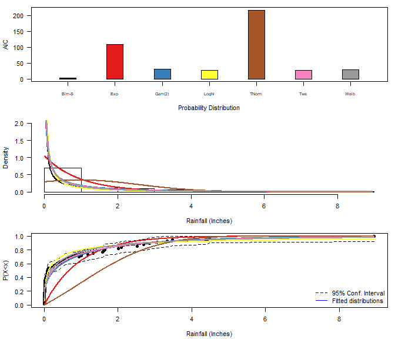

    ## $AIC
    ##   Distribution        AIC
    ## 1           BS   2.176048
    ## 2          Exp 109.105046
    ## 3         Gam2  31.298352
    ## 4         LogN  26.943586
    ## 5        TNorm 216.414450
    ## 6          Twe  26.185671
    ## 7         Weib  29.313609
    ## 
    ## $Best_fit
    ## [1] BS
    ## Levels: BS Exp Gam2 LogN TNorm Twe Weib

``` r
Diag_Non_Con_Trunc_Sel(Data=S20.OsWL$Data$Rainfall+0.001,x_lab="Rainfall (Inches)",
y_lim_min=0,y_lim_max=2,
Selected="BS")
```

    ## 1.5 1.7 1.9 2.1 2.3 2.5 
    ## ......Done.

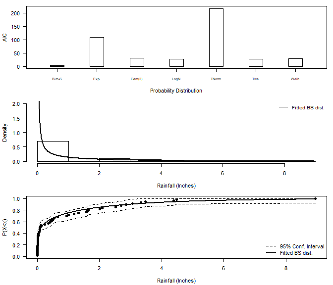

The `Design_Event_2D()` function finds the isoline associated with a particular return period, by overlaying the two corresponding isolines from the joint distributions fitted to the conditional samples using the method in Bender et al. (2016). `Design_Event_2D()` requires the copulas families chosen to model the dependence structure in the two conditional samples as input.

``` r
S20.Copula.Rainfall<-Copula_Threshold_2D(Data_Detrend=S20.Detrend.df[,-c(1,4)],
Data_Declust=S20.Detrend.Declustered.df[,-c(1,4)],
u1=Rainfall.Thres.Quantile,u2=NA,
y_lim_min=0,y_lim_max=0.25, GAP=0.075)$Copula_Family_Var1
```

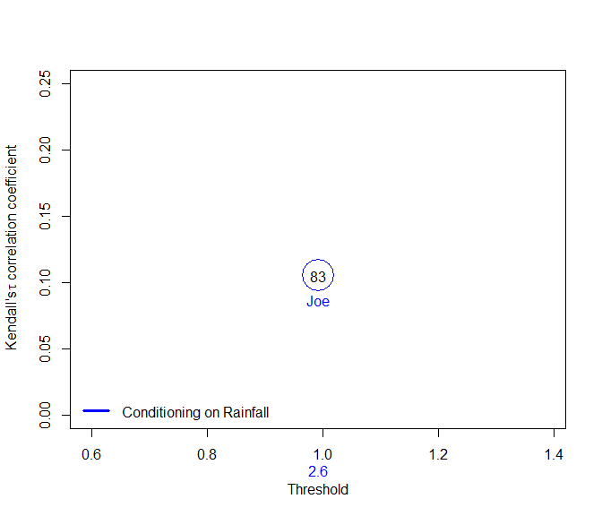

``` r
S20.Copula.OsWL<-Copula_Threshold_2D(Data_Detrend=S20.Detrend.df[,-c(1,4)],
Data_Declust=S20.Detrend.Declustered.df[,-c(1,4)],
u1=NA,u2=OsWL.Thres.Quantile,
y_lim_min=0,y_lim_max=0.25,GAP=0.075)$Copula_Family_Var2
```

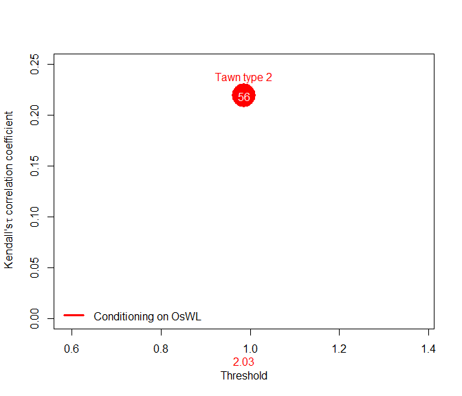

As input the function requires

-   Data = Original (detrended) rainfall and O-sWL series
-   Data\_Con1/Data\_Con2 = two conditionally sampled datasets,
-   u1/u2 or Thres1/Thres2 = two thresholds associated with the conditionally sampled datasets
-   Copula\_Family1/Copula\_Family2 two families of the two fitted copulas
-   Marginal\_Dist1/Marginal\_Dist2 Selected non-extreme margnal distributions
-   HazScen = Hazard scenario (AND/OR)
-   RP = Return Period of interest
-   N = size of the sample from the fitted joint distributions used to estimate the density along the isoline of interest
-   N\_Ensemble = size of the ensemble of events sampled along the isoline of interest

``` r
S20.Bivariate<-Design_Event_2D(Data=S20.Detrend.df[,-c(1,4)], 
Data_Con1=S20.Rainfall$Data, 
Data_Con2=S20.OsWL$Data, 
u1=Rainfall.Thres.Quantile, 
u2=OsWL.Thres.Quantile, 
Copula_Family1=S20.Copula.Rainfall,
Copula_Family2=S20.Copula.OsWL, 
Marginal_Dist1="Logis", Marginal_Dist2="BS",
x_lab="Rainfall (mm)",y_lab="O-sWL (m NGVD 29)",
RP=100,N=10^7,N_Ensemble=10)
```

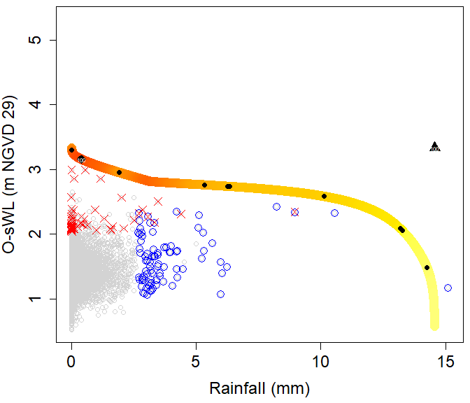

Design event according to the "Most likely" event approach (diamond in the plot)

``` r
S20.Bivariate$MostLikelyEvent$`100`
```

    ##    Rainfall     OsWL
    ## 1 0.4100399 3.156319

Design event under the assuption of full dependence (Triangle in the plot)

``` r
S20.Bivariate$FullDependence$`100`
```

    ##   Rainfall OsWL
    ## 1    14.56 3.33

The `Conditional_RP_2D()` function finds the (conditional) probability that a variable exceeds a return period `RP_Non_Con` given the second variable `Con_Var` exceeds a particular return period `RP_Con`. To find the conditional probabilities a large number of realizations are simulated from the copulas fit to the conditioned samples, in proportion with the sizes of the conditional samples. The realizations are transformed to the original scale and the relevant probabilities estimated empirically.

Let's find the probability of observing an O-sWL with a greater than 10-year return period given a rainfall event with a return period exceeding 10-years.

``` r
S20.Conditional<-Conditional_RP_2D(Data=S20.Detrend.df[,-c(1,4)], 
                                   Data_Con1=S20.Rainfall$Data, 
                                   Data_Con2=S20.OsWL$Data, 
                                   Thres1=Rainfall.Thres.Quantile,
                                   Thres2=OsWL.Thres.Quantile, 
                                   Copula_Family1=S20.Copula.Rainfall,
                                   Copula_Family2=S20.Copula.OsWL,
                                   Con1 = "Rainfall", Con2 = "OsWL",
                                   Marginal_Dist1="Logis", Marginal_Dist2="BS",
                                   Con_Var="Rainfall",
                                   RP_Con=10, RP_Non_Con=10,
                                   x_lab="Rainfall (mm)",y_lab="O-sWL (m NGVD 29)",
                                   N=10^7)
```

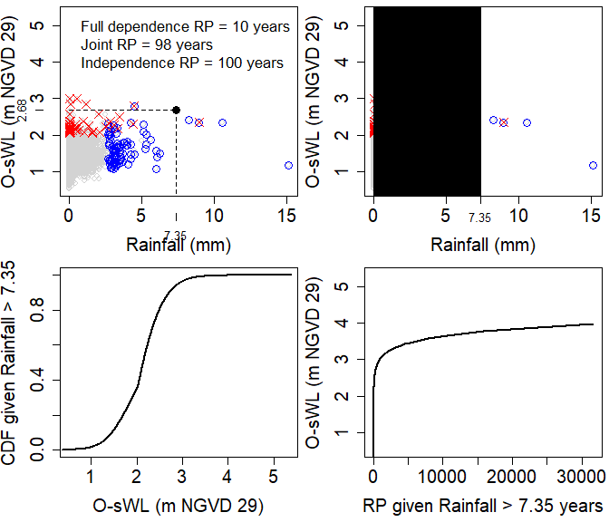

Design event according to the "Most likely" event approach (diamond in the plot)

``` r
S20.Bivariate$MostLikelyEvent$`100`
```

    ##    Rainfall     OsWL
    ## 1 0.4100399 3.156319

Design event under the assuption of full dependence (Triangle in the plot)

``` r
S20.Bivariate$FullDependence$`100`
```

    ##   Rainfall OsWL
    ## 1    14.56 3.33

The `Conditional_RP_2D()` function finds the (conditional) probability that a variable exceeds a return period `RP_Non_Con` given the second variable `Con_Var` exceeds a particular return period `RP_Con`. To find the conditional probabilities a large number of realizations are simulated from the copulas fit to the conditioned samples, in proportion with the sizes of the conditional samples. The realizations are transformed to the original scale and the relevant probabilities estimated empirically.

Let's find the probability of observing an O-sWL with a greater than 10-year return period given a rainfall event with a return period exceeding 10-years.

``` r
S20.Conditional<-Conditional_RP_2D(Data=S20.Detrend.df[,-c(1,4)], 
Data_Con1=S20.Rainfall$Data, 
Data_Con2=S20.OsWL$Data, 
u1=Rainfall.Thres.Quantile,
u2=OsWL.Thres.Quantile, 
Copula_Family1=S20.Copula.Rainfall,
Copula_Family2=S20.Copula.OsWL,
Con1 = "Rainfall", Con2 = "OsWL",
Marginal_Dist1="Logis", Marginal_Dist2="BS",
Con_Var="Rainfall",
RP_Con=10, RP_Non_Con=10,
x_lab="Rainfall (mm)",y_lab="O-sWL (m NGVD 29)",
N=10^6)
```


The joint return period of the two events is

``` r
#Under independence
S20.Conditional$RP_Full_Dependence
```

    ## [1] 10

``` r
#Under full dependence
S20.Conditional$RP_Independence
```

    ## [1] 100

``` r
#Accounting for the dependence
S20.Conditional$RP_Copula
```

    ## [1] 98.07175

``` r
#which corresponds to a probability of 
S20.Conditional$Prob
```

    ## [1] 0.01019662

The cummulative distribution of O-sWL given a 10-year rainfall event

``` r
#First 10 values of the non-conditioning variables (here, O-sWL)
S20.Conditional$Non_Con_Var_X[1:10]
```

    ##  [1] 0.41 0.42 0.43 0.44 0.45 0.46 0.47 0.48 0.49 0.50

``` r
#Conditional probabilities associated with these values i.e. of the O-sWLs given a 10-year rainfall 
S20.Conditional$Con_Prob[1:10]
```

    ##  [1] 0.001021323 0.001084079 0.001146836 0.001209593 0.001272350 0.001335107
    ##  [7] 0.001397863 0.001460620 0.001523377 0.001586134

``` r
#The above probabilities converted to return periods
S20.Conditional$Con_Prob[1:10]
```

    ##  [1] 0.001021323 0.001084079 0.001146836 0.001209593 0.001272350 0.001335107
    ##  [7] 0.001397863 0.001460620 0.001523377 0.001586134

The `Conditional_RP_2D_Equal()` function finds the (conditional) probability that a variable exceeds a return period `RP_Non_Con` given a second variable `Con_Var` has a particular return period `RP_Con`.

``` r
S20.Conditional<-Conditional_RP_2D_Equal(Data=S20.Detrend.df[,-c(1,4)],
Data_Con1=S20.Rainfall$Data, 
Data_Con2=S20.OsWL$Data, 
u1=Rainfall.Thres.Quantile,
u2=OsWL.Thres.Quantile,
Copula_Family1=S20.Copula.Rainfall,
Copula_Family2=S20.Copula.OsWL,
Con1 = "Rainfall", Con2 = "OsWL",
Marginal_Dist1="Logis", Marginal_Dist2="Twe",
Con_Var="Rainfall",
RP_Con=10, RP_Non_Con=10,
x_lab="Rainfall (mm)",y_lab="O-sWL (m NGVD 29)",
N=10^6)
```

    ## Warning in densfun(x, parm[1], parm[2], ...): NaNs produced

    ## Warning in densfun(x, parm[1], parm[2], ...): NaNs produced

    ## Warning in densfun(x, parm[1], parm[2], ...): NaNs produced

    ## Warning in densfun(x, parm[1], parm[2], ...): NaNs produced

    ## Warning in densfun(x, parm[1], parm[2], ...): NaNs produced

    ## 1.5 1.7 1.9 2.1 2.3 2.5 
    ## .....

    ## Warning: glm.fit: algorithm did not converge

    ## .Done.

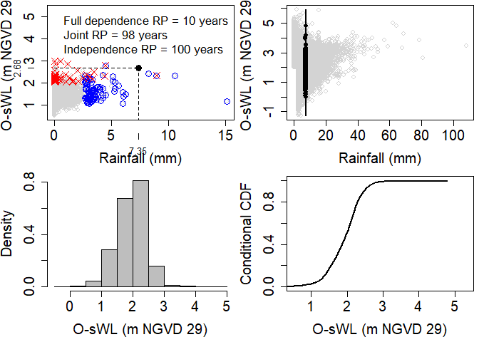

The outputs are analogous to those of the `Conditional_RP_2D()` function.

Cooley (2019) puts forward a non-parametric approach for constructing the isoline associated with exceedance probably *p*. The approach centers around constructing a base isoline with a larger exceedance probability *p*<sub>*b**a**s**e*</sub> &gt; *p* and projecting it to more extreme levels. *p*<sub>*b**a**s**e*</sub> should be small enough to be representative of the extremal dependence but large enough for sufficient data to the involved in the estimation procedure.

The approach begins by approximating the joint survival function via a kernel density estimator from which the base isoline is derived. For the marginal distributions, a GPD is fit above a sufficiently high threshold to allow extrapolation into the tails and the empirical distribution is used below the threshold. Unless the joint distribution of the two variables is regularly varying, a marginal transformation is required for the projection. The two marginals are thus transformed to Frechet scales. For asymptotic dependence, on the transformed scale the isoline with exceedance probability *p* can be obtained as *l*<sub>*T*</sub>(*p*)=*s*<sup>−1</sup>*l*<sub>*T*</sub>(*p*<sub>*b**a**s**e*</sub>) where $\\frac{p\_{base}}{p}&gt;1$. For the case of asymptotic independence, $l\_{T}{p}=s^{\\frac{1}{\\eta}}l\_{T}(p\_{base})$, where *η* is the tail dependence coefficient. Applying the inverse Frechet transformation gives the isoline on the original scale.

Let's estimate the 100-year (p=0.01) rainfall-OsWL isoline at S20 using the 10-year isoline as the base isoline.

``` r
#Fitting the marginal distribution
#See next section for information on the Migpd_Fit function
S20.GPD<-Migpd_Fit(Data=S20.Detrend.Declustered.df[,-1], Data_Full = S20.Detrend.df[,-1], 
                   mqu =c(0.99,0.99,0.99))
#10-year exceedance probability for daily data
p.10<-(1/365.25)/10
#10-year exceedance probability for daily data
p.100<-(1/365.25)/100
#Calculating the isoline
isoline<-Cooley19(Data=na.omit(S20.Detrend.df[,2:3]),Migpd=S20.GPD,
                  p.base=p.10,p.proj=p.100,PLOT=TRUE,x_lim_max_T=15000,y_lim_max_T=15000)
```

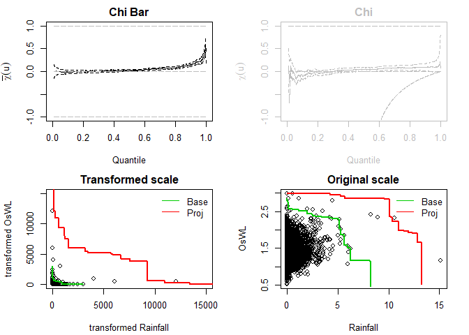

## 5. Trivariate analysis

In the report three higher dimensional (&gt;3) approaches are implemented to model the joint distribution of rainfall, O-sWL and groundwater level, they are:

-   Standard (trivariate) copula
-   Pair Copula Construction
-   Heffernan and Tawn (2004)

In the package, each approach has a `_Fit` and `_Sim` function. The latter requires a `MIGPD` object as its `Marginals` input argument, in order for the simulations on \[0, 1\]3 to be transformed back to the original scale. The `Migpd_Fit` command fits independent GPDs to the data in each row of a dataframe (excluding the first column if it is a "Date" object) creating a `MIGPD` object.

``` r
S20.Migpd<-Migpd_Fit(Data=S20.Detrend.Declustered.df[,-1],Data_Full = S20.Detrend.df[,-1],
                     mqu=c(0.975,0.975,0.9676))
summary(S20.Migpd)
```

    ## $d
    ## [1] 3
    ## 
    ## $conv
    ## NULL
    ## 
    ## $penalty
    ## [1] "gaussian"
    ## 
    ## $co
    ##                   Rainfall      OsWL Groundwater
    ## Threshold        1.6000000 1.9385406   2.8599327
    ## P(X < threshold) 0.9750000 0.9750000   0.9676000
    ## sigma            0.9040271 0.1574806   0.3083846
    ## xi               0.1742220 0.2309118  -0.3441421
    ## Upper end point        Inf       Inf   3.7560295
    ## 
    ## attr(,"class")
    ## [1] "summary.migpd"

Standard (trivariate) copula are the most conceptually simple of the copula based models, using a single parametric multivariate probability distribution as the copula. The Standard\_Copula\_Fit() function fits elliptic (specified by `Gaussian` or `tcop`) or Archimedean (specified by `Gumbel`,`Clayton` or `Frank`) copula to a trivariate dataset. Let first fit a Gaussian copula

``` r
S20.Gaussian<-Standard_Copula_Fit(Data=S20.Detrend.df,Copula_Type="Gaussian")
```

From which the Standard\_Copula\_Sim() function can be used to simulate a synthetic record of N years

``` r
S20.Gaussian.Sim<-Standard_Copula_Sim(Data=S20.Detrend.df,Marginals=S20.Migpd,
                                      Copula=S20.Gaussian,N=100)
```

Plotting the observationed and simulated values

``` r
S20.Pairs.Plot.Data<-data.frame(rbind(na.omit(S20.Detrend.df[,-1]),S20.Gaussian.Sim$x.Sim),
                                c(rep("Observation",nrow(na.omit(S20.Detrend.df))),
                                  rep("Simulation",nrow(S20.Gaussian.Sim$x.Sim))))
colnames(S20.Pairs.Plot.Data)<-c(names(S20.Detrend.df)[-1],"Type")
pairs(S20.Pairs.Plot.Data[,1:3],
      col=ifelse(S20.Pairs.Plot.Data$Type=="Observation","Black",alpha("Red",0.3)),
      upper.panel=NULL,pch=16)
```

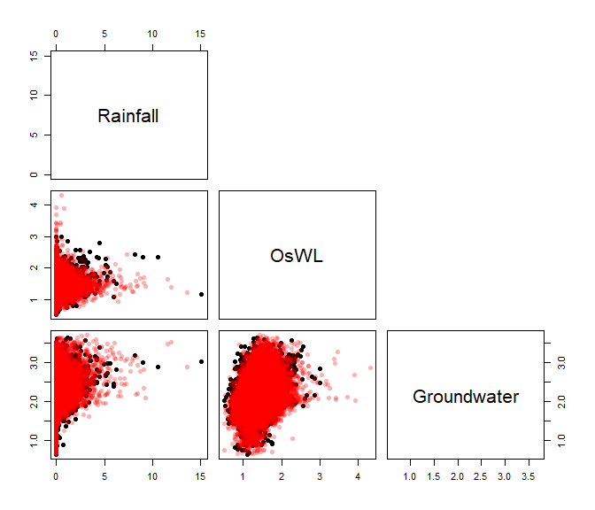

The Standard\_Copula\_Sel() function can be used to deduce the best fitting in terms of AIC

``` r
Standard_Copula_Sel(Data=S20.Detrend.df)
```

    ## Warning in var.mpl(copula, u): the covariance matrix of the parameter estimates
    ## is computed as if 'df.fixed = TRUE' with df = 16.1271469165612

    ##     Copula        AIC
    ## 1 Gaussian -1389.1438
    ## 2    t-cop -1434.7850
    ## 3   Gumbel  -876.7537
    ## 4  Clayton  -565.7595
    ## 5    Frank  -854.4284

Standard trivariate copulas lack flexibility to model joint distributions where heterogeneous dependencies exist between the variable pairs. Pair copula constructions construct multivariate distribution using a cascade of bivariate copulas (some of which are conditional). As the dimensionality of the problem increases the number of mathematically equally valid decompositions quickly becomes large. Bedford and Cooke (2001,2002) introduced the regular vine, a graphical model which helps to organize the possible decompositions. The Canonical (C-) and D- vine are two commonly utilized sub-categories of regular vines, in the trivariate case a vine copula is simultaneously a C- and D-vine. Lets fit a regular vine copula model

``` r
S20.Vine<-Vine_Copula_Fit(Data=S20.Detrend.df)
```

From which the Vine\_Copula\_Sim() function can be used to simulate a synthetic record of N years

``` r
S20.Vine.Sim<-Vine_Copula_Sim(Data=S20.Detrend.df,Vine_Model=S20.Vine,Marginals=S20.Migpd,N=100)
```

    ## Warning in (1 - u)/p: longer object length is not a multiple of shorter object
    ## length

Plotting the observationed and simulated values

``` r
S20.Pairs.Plot.Data<-data.frame(rbind(na.omit(S20.Detrend.df[,-1]),S20.Vine.Sim$x.Sim),
                                c(rep("Observation",nrow(na.omit(S20.Detrend.df))),
                                  rep("Simulation",nrow(S20.Vine.Sim$x.Sim))))
colnames(S20.Pairs.Plot.Data)<-c(names(S20.Detrend.df)[-1],"Type")
pairs(S20.Pairs.Plot.Data[,1:3],
      col=ifelse(S20.Pairs.Plot.Data$Type=="Observation","Black",alpha("Red",0.3)),
      upper.panel=NULL,pch=16)
```


Finally, lets implement the Heffernan and Tawn (2004) approach, where a non-linear regression model is fitted to the (joint) observations where a (conditioning) variable is above a specified threshold. The regression model typically adopted is
$$\\textbf{Y}\_{-i}=\\textbf{a}Y\_{i}+Y\_{i}^{b}\\textbf{Z} \\hspace{1cm} for \\hspace{1cm} Y\_{i}&gt;v$$
 where **Y** is a set of variables transdformed to a common scale, **Y**<sub>−*i*</sub> is the set of variables excluding *Y*<sub>−*i*</sub>, **a** and **b** are vecotrs of regression parameters and **Z** is a vecotr of residuals. The dependence structure, when a specified variable is extreme is thus captured by the regression parameters and the joint residuals. The procedure is repeated conditioning on each variable in turn to build up of the joint distribution when at least one variable is in an extreme state. The `HT04` command fits and simulates N years worth of simulations from the model.

``` r
S20.HT04<-HT04(data_Detrend_Dependence_df=S20.Detrend.df,
               data_Detrend_Declustered_df=S20.Detrend.Declustered.df,
               u_Dependence=0.995,Migpd=S20.Migpd,mu=365.25,N=1000)
```

Output of the function includes the three conditional `Models`, proportion of occasions where each variable is most extreme given at least one variable is extreme `prop`as well as, the simulations on the transfromed scale `u.Sim` (gumbel by default) and original scale `x.Sim`. Lets view the fitted model when conditioning on rainfall

``` r
S20.HT04$Model$Rainfall
```

    ## mexDependence(x = Migpd, which = colnames(data_Detrend_Dependence_df)[i], 
    ##     dqu = u_Dependence, margins = "gumbel", constrain = FALSE, 
    ##     v = V, maxit = Maxit)
    ## 
    ## 
    ## Marginal models:
    ## 
    ## Dependence model:
    ## 
    ## Conditioning on Rainfall variable.
    ## Thresholding quantiles for transformed data: dqu = 0.995
    ## Using gumbel margins for dependence estimation.
    ## Log-likelihood = -110.9748 -86.29157 
    ## 
    ## Dependence structure parameter estimates:
    ##     OsWL Groundwater
    ## a 1.0000      0.3678
    ## b 0.7136     -1.6900

``` r
S20.HT04$Prop
```

    ## [1] 0.3552632 0.3157895 0.3289474

and the which the proporiton of the occasions in the original sample that rainfall is the most extreme of the drivers given that at least one driver is extreme.

The HT04 approach uses rejection sampling to generate synthetic records. The first step involves sampling a variable, conditioned to exceed the `u_Dependence` threshold. A joint residual associated with the corresponding regression is independently sampled and other variables estimated using the fitted regression parameters. If the variable conditioned to be extreme in step one is not the most extreme the sample is rejected. The process is repeated until the relative proportion of simulated events where each variable is a maximum, conditional on being above the threshold, is consistent with the empirical distribution. Labelling the simulations `S20.HT04.Sim`

``` r
S20.HT04.Sim<-S20.HT04$x.sim
```

and now plotting the simulations from the HT04 model

``` r
S20.Pairs.Plot.Data<-data.frame(rbind(na.omit(S20.Detrend.df[,-1]),S20.HT04.Sim),
                                c(rep("Observation",nrow(na.omit(S20.Detrend.df))),
                                  rep("Simulation",nrow(S20.HT04.Sim))))
colnames(S20.Pairs.Plot.Data)<-c(names(S20.Detrend.df)[-1],"Type")
pairs(S20.Pairs.Plot.Data[,1:3],
      col=ifelse(S20.Pairs.Plot.Data$Type=="Observation","Black",alpha("Red",0.2)),
      upper.panel=NULL,pch=16)
```


## 6. Sea Level Rise

The SLR\_Scenarios function estimates the time required for a user-specified amount of sea level rise ( `SeaLevelRise`) to occur under various sea level rise scenarios. The default scenarios are for Key West from the Southeast Florida Regional Climate Change Compact (2019). Let's calculate how long before the O-sWL in the 100-year "most-likely" design event (see section 4) equals that of the corresponding design event derived under full dependence.

``` r
#Difference in O-sWL between the most-liely and fuill dependence events
Diff<-S20.Bivariate$FullDependence$`100`$OsWL-S20.Bivariate$MostLikelyEvent$`100`$OsWL
Diff
```

    ## [1] 0.1736809

``` r
#Time in years for the sea level rise to occur
SLR_Scenarios(SeaLevelRise=Diff,Unit="m")
```

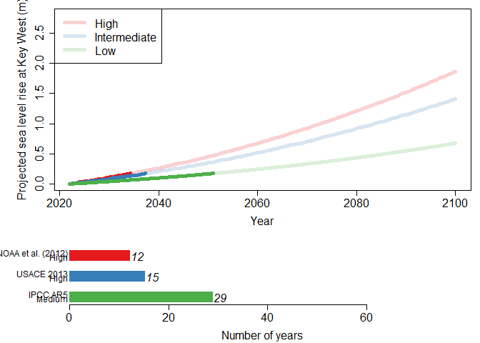

    ## $High
    ## [1] 2034
    ## 
    ## $Intermediate
    ## [1] 2037
    ## 
    ## $Low
    ## [1] 2051

Scenarios from theInteragency Sea Level Rise Scenario Tool (2022) for Miami Beach and Naples can be utilized by changing the `Scenario` and `Location` arguments. Alternatively, a user can input other sea level rise scenarios into the function. For example, below we use the scenarios from the same tool but for Fort Myers.

``` r
SeaLevelRise.2022<-read.csv("C://Users//Documents//sl_taskforce_scenarios_psmsl_id_1106_Fort_Myers.csv")
SeaLevelRise.2022_input<-data.frame(Year=seq(2020,2150,10),
"High"=as.numeric(SeaLevelRise.2022[14,-(1:5)])/1000,
"Int_Medium"=as.numeric(SeaLevelRise.2022[11,-(1:5)])/1000,
"Medium"=as.numeric(SeaLevelRise.2022[8,-(1:5)])/1000,
"Int_Low"=as.numeric(SeaLevelRise.2022[5,-(1:5)])/1000,
"Low"=as.numeric(SeaLevelRise.2022[2,-(1:5)])/1000)
SLR_Scenarios(SeaLevelRise=0.8, Scenario="Other", Unit = "m", Year=2022, 
              Location="Fort Myers", New_Scenario=SeaLevelRise.2022_input)
```

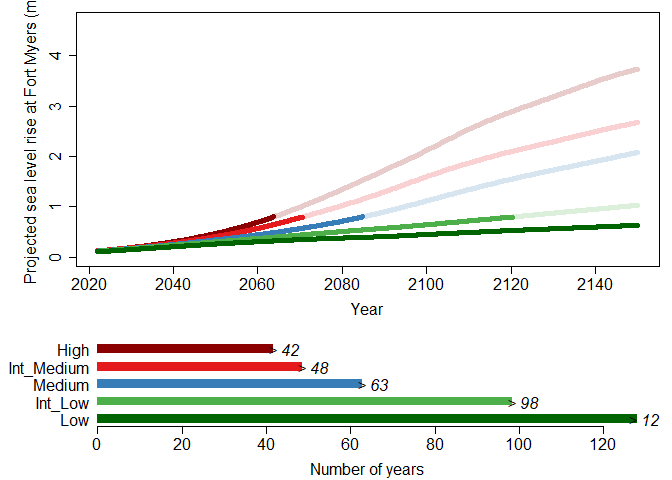

    ## $SLR_Year
    ## [1] 2150 2120 2085 2070 2064
